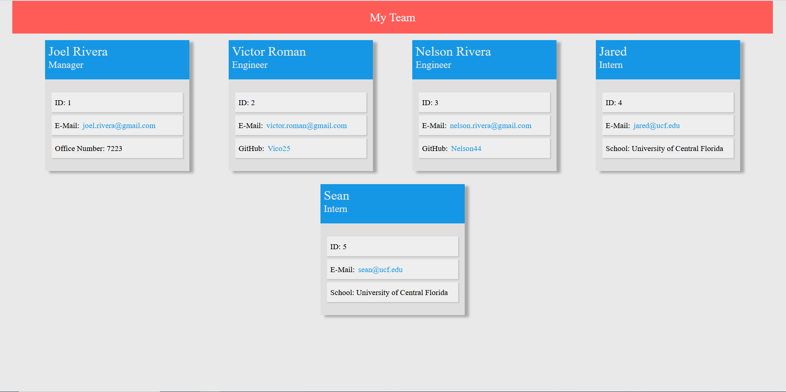

# Team Profile Generator

## Description
Team Profile Generator is an node js command line application thats generates a template html & css files
based on the user inputs. Allowing the user to add a single Manager and multiple Engineers & Interns based in the 
user desicion.

## Installation
Clone the project
```
git clone https://github.com/JulioRios15/Team-Profile-Generator.git
```

Move to root directory
```
cd team-profile-generator
```
Install packages

```
npm install
```

Run the Team Profile generator

```
npm run generate-team-profile
```

## Preview

### Desktop View



### Mobile View


### Template HTML

``` html
    <!DOCTYPE html>
    <html lang="en">
    <head>
        <meta charset="UTF-8">
        <meta http-equiv="X-UA-Compatible" content="IE=edge">
        <meta name="viewport" content="width=device-width, initial-scale=1.0">
        <title>Employee Roster</title>
        <link rel="stylesheet" href="./styles.css">
    </head>
    <body>
        <header class="header">My Team</header>   

        <div class="container">
            
    <div class="employee-card">
        <div class="employee-card-header">
            <h2>Joel Rivera</h2>
            <h3><span></span>Manager</h3>
        </div>
        <div class="employee-card-content">
            <div class="employee-card-content-item">
                ID: 1
            </div>      
            <div class="employee-card-content-item">
                E-Mail: <a href = "mailto: joel.rivera@gmail.com">joel.rivera@gmail.com</a>
            </div>      
            <div class="employee-card-content-item">
                Office Number: 7223
            </div>      
        </div>
    </div>
    
    <div class="employee-card">
        <div class="employee-card-header">
            <h2>Victor Roman</h2>
            <h3><span></span>Engineer</h3>
        </div>
        <div class="employee-card-content">
            <div class="employee-card-content-item">
                ID: 2
            </div>      
            <div class="employee-card-content-item">
                E-Mail: <a href = "mailto: victor.roman@gmail.com">victor.roman@gmail.com</a>
            </div>      
            <div class="employee-card-content-item">
                GitHub: <a href = "https://github.com/Vico25" target="_blank">Vico25</a>
            </div>      
        </div>
    </div>
    
    <div class="employee-card">
        <div class="employee-card-header">
            <h2>Nelson Rivera</h2>
            <h3><span></span>Engineer</h3>
        </div>
        <div class="employee-card-content">
            <div class="employee-card-content-item">
                ID: 3
            </div>      
            <div class="employee-card-content-item">
                E-Mail: <a href = "mailto: nelson.rivera@gmail.com">nelson.rivera@gmail.com</a>
            </div>      
            <div class="employee-card-content-item">
                GitHub: <a href = "https://github.com/Nelson44" target="_blank">Nelson44</a>
            </div>      
        </div>
    </div>
    
    <div class="employee-card">
        <div class="employee-card-header">
            <h2>Jared</h2>
            <h3><span></span>Intern</h3>
        </div>
        <div class="employee-card-content">
            <div class="employee-card-content-item">
                ID: 4
            </div>      
            <div class="employee-card-content-item">
                E-Mail: <a href = "mailto: jared@ucf.edu">jared@ucf.edu</a>
            </div>      
            <div class="employee-card-content-item">
                School: University of Central Florida
            </div>      
        </div>
    </div>
    
    <div class="employee-card">
        <div class="employee-card-header">
            <h2>Sean</h2>
            <h3><span></span>Intern</h3>
        </div>
        <div class="employee-card-content">
            <div class="employee-card-content-item">
                ID: 5
            </div>      
            <div class="employee-card-content-item">
                E-Mail: <a href = "mailto: sean@ucf.edu">sean@ucf.edu</a>
            </div>      
            <div class="employee-card-content-item">
                School: University of Central Florida
            </div>      
        </div>
    </div>
    
        </div>
        
    </body>
    </html>
    
```


